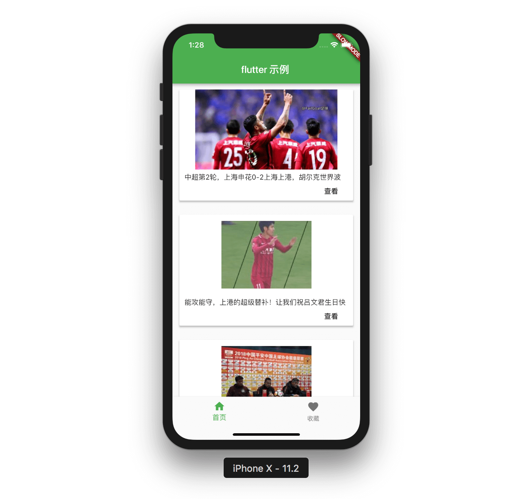

<p align="center">
    
</p>

-------

This project a simple example about potential of Dart + Flutter for create mobile apps cross-platform with one code.

### How to run

You need lastest version of Flutter installed in your system for build and run the project.

```shell
$ flutter run
```


### License	

 See [MIT LICENSE](LICENSE) for details.